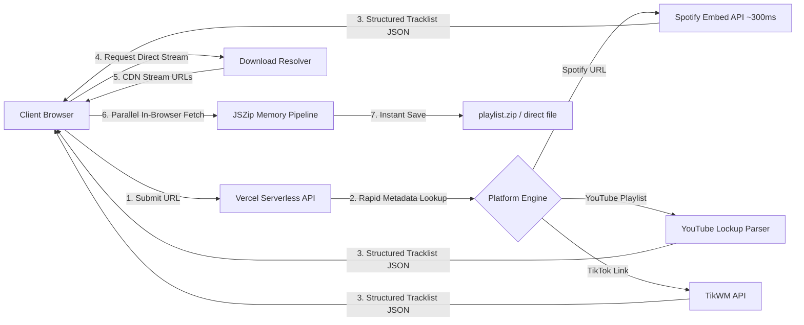

# 🎵 PlaylistGet — Vercel Serverless Edition (`vercel-api` Branch)

<p align="center">
  
  
  
  
  
</p>

---

## 📌 Overview & Architecture

**PlaylistGet (Vercel API Edition)** is a lightweight, zero-binary, serverless media downloader built to run **100% free on Vercel** without needing any backend server, Docker container, Python, `yt-dlp`, or `ffmpeg`. 

By decoupling media resolution into **Vercel Serverless Functions (`api/`)** and performing file streaming & ZIP archiving directly in the **client browser via `JSZip`**, PlaylistGet eliminates all serverless timeout limits and server CPU bottlenecks.

---

## ⚡ Supported Platforms

| Platform | Features Supported | Engine |
|---|---|---|
| **YouTube & YouTube Music** | Single Videos, Music Tracks, and Full Playlists | HTML Lockup Parser & oEmbed |
| **Spotify** | Single Tracks, Albums, and Playlists with individual track album art | Spotify Embed API (~300ms instant) |
| **TikTok** | Full HD Videos without watermark & MP3 Audio | TikWM API & Official oEmbed |

> ℹ️ **Note on Instagram & Facebook:** Meta platforms enforce strict login walls on serverless/datacenter IPs. For full Instagram and Facebook downloading with `yt-dlp`, use our **[`main` branch](https://github.com/satriaksm/playlistget/tree/main)** (Self-Hosted / GitHub Codespaces edition).

---

## 🌟 Key Features

### 🚀 100% Serverless & Zero-Binary
- **No `yt-dlp` & No `ffmpeg` Needed:** Pure JavaScript serverless handlers running on Vercel Node.js runtime.
- **Blazing Fast Metadata (~300ms):** Spotify playlists with 50+ tracks are parsed in less than 0.3 seconds.
- **Individual Spotify Album Art:** Automatically fetches the authentic high-resolution album cover for each song in a playlist.

### 📦 In-Browser ZIP Bundling (`JSZip`)
- Downloads multiple tracks concurrently and bundles them into a clean `.zip` archive **directly in the user's browser memory**.
- Completely bypasses Vercel's 10-second execution timeout and 4.5MB payload limit.

### 🎨 Clean Glassmorphic User Interface
- Responsive, modern dark UI with live search filtering, per-track checkbox selectors, and real-time progress indicators.
- One-click clipboard paste button and interactive example presets.

---

## 🏗️ System Workflow



---

## 🚀 One-Click Deploy to Vercel

### 1. Push this branch to your GitHub repository:
```bash
git add .
git commit -m "Deploy Vercel-native API edition"
git push origin vercel-api
```

### 2. Connect to Vercel:
1. Go to **[vercel.com](https://vercel.com/)** and log in.
2. Click **Add New... $\rightarrow$ Project** and select your `playlistget` repository.
3. In the project settings, set **Production Branch** to **`vercel-api`**.
4. Click **Deploy**!

Your downloader will be live at `https://your-project.vercel.app` with zero server costs!

---

## 💻 Local Development

You can also run the Vercel API edition locally on your machine without installing `yt-dlp` or `ffmpeg`:

```bash
# 1. Install dependencies
npm install

# 2. Start the local server
npm start
```

Open **`http://localhost:3000`** in your browser.

---

## 📁 Repository Branches

- **`vercel-api` (This Branch)**: 100% Serverless, Zero-Binary API edition for Vercel deployment. Supports YouTube, Spotify, and TikTok with client-side ZIP bundling.
- **`main`**: Full self-hosted container edition with `yt-dlp` and `ffmpeg` support for GitHub Codespaces, Docker, and Linux servers (supports 1,000+ websites including Instagram and Facebook).

---

## 📄 License

MIT License. Designed for personal and educational use.
