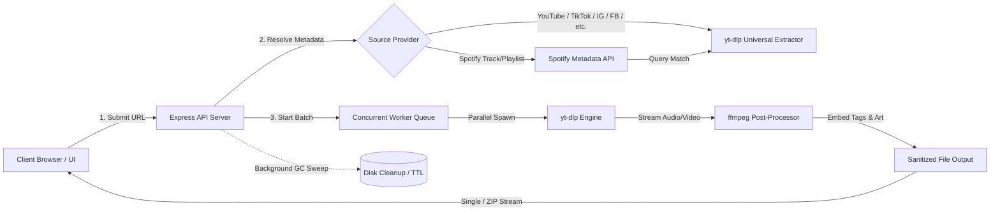

# 🎵 PlaylistGet — Universal Media & Playlist Downloader

<p align="center">
  
  
  
  
  
  
</p>

---

## 📌 Overview & Architecture

**PlaylistGet** is a high-performance, self-hosted media processing platform and batch downloader engineered to fetch single tracks, albums, reels, videos, and full playlists from **YouTube**, **TikTok**, **Instagram**, **Facebook**, **Spotify**, **Twitter / X**, **SoundCloud**, and **1,000+ websites**, converting them into studio-grade **MP3** (with embedded ID3 tags & cover art) or high-definition **MP4** videos. Built on an asynchronous, event-driven client-server architecture, PlaylistGet pairs a responsive glassmorphic frontend with an **Express.js** backend orchestrator; this orchestrator manages concurrent worker pools dispatching isolated `yt-dlp` and `ffmpeg` subprocesses, streams real-time telemetry (progress, speed, ETA) to the client, sanitizes media filenames, and delivers output either as single file streams or through a zero-CPU, uncompressed ZIP archive pipeline backed by an automated lifecycle garbage collector.

---

## ⚡ Complete Feature Breakdown

### 🌐 Universal Multi-Platform Ingestion
- **YouTube & YouTube Music**: Download single videos, full channel playlists, public/unlisted mix playlists, or music tracks with automated metadata parsing.
- **TikTok**: Extract full HD TikTok videos (without watermark) and high-quality audio streams.
- **Instagram**: Seamlessly fetch Instagram Reels, video posts, carousel media, and stories.
- **Facebook**: Download Facebook Watch clips, reels, and public shared videos.
- **Spotify Smart Resolution**: Ingest Spotify track, album, and playlist links via metadata lookup, automatically matching and fetching the best audio stream from YouTube.
- **Twitter / X & SoundCloud**: Download tweets containing videos or full audio tracks and sets from SoundCloud.
- **1,000+ Additional Platforms**: Native support via `yt-dlp` engine for Reddit, Vimeo, Dailymotion, Bilibili, Pinterest, Twitch, Threads, and more.
- **Interactive Track Selector**: Preview media contents, view thumbnails, durations, and creators, and choose exactly which items to download with one-click bulk toggles (Select All / Deselect All).

### 🎛️ Audio & Video Engine
- **Audio Conversion (MP3)**: Selectable bitrates from `128 kbps` up to studio-quality `320 kbps`.
- **Video Downloads (MP4)**: Resolution presets including `480p`, `720p`, `1080p Full HD`, and `Best Quality`.
- **ID3 Metadata & Artwork Injection**: Automatically embeds high-resolution album cover art and song metadata directly into downloaded MP3 files using `ffmpeg`.
- **Intelligent Filename Sanitizer**: Strips redundant platform clutter (e.g., `- Topic`, `VEVO`, `Official Video`, `NA/Unknown`), preserves clean `Artist - Title` naming, and purges OS-restricted characters.

### 🚀 Performance & High Throughput
- **Concurrent Worker Pool**: Parallel worker queue (`CONCURRENT_DOWNLOADS_PER_SESSION`) to process multiple media items simultaneously within each session for maximum download speed.
- **Zero-CPU ZIP Bundling**: Multi-item downloads are packaged on-the-fly using store-level (level 0) ZIP streaming (`archiver`), eliminating server CPU bottlenecks during archiving.
- **Real-Time Telemetry**: Live polling delivering per-file download progress percentage, current download speed (e.g., `5.24 MiB/s`), estimated time of arrival (ETA), and live status logs.

### 🛡️ Security & Resource Governance
- **Built-in Rate Limiting**: In-memory IP rate limiter preventing denial-of-service and API abuse.
- **Session & Concurrency Caps**: Configurable limits on concurrent active sessions, total batch size per playlist, and request payload size.
- **Automated Lifecycle Garbage Collector**: Periodic sweeps auto-clean completed session directories after expiry (default: 30 mins) and terminate orphaned/stuck downloads (default: 60 mins).
- **Directory Traversal Protection**: Strict UUID session validation and path verification prevents arbitrary file system access.
- **Bot-Check Mitigation**: Native support for Netscape-formatted YouTube cookies to bypass bot checks and age restrictions.
- **Read-Only / Cloud Fallback**: Automatically falls back to the operating system temporary directory if the working directory is restricted or read-only.

---

## 🏗️ System Workflow



---

## 📋 Prerequisites

- **[Node.js](https://nodejs.org/)** v18.0.0 or higher
- **[yt-dlp](https://github.com/yt-dlp/yt-dlp)** installed and available in system `PATH`
- **Python 3** (required by yt-dlp)

> 💡 **Note:** `ffmpeg` is automatically bundled via `ffmpeg-static`. No manual ffmpeg installation is necessary on host systems!

### Installing `yt-dlp`

```bash
# Via Python PIP (Recommended)
pip install -U yt-dlp

# Windows (via winget or Scoop)
winget install yt-dlp
# or: scoop install yt-dlp

# macOS (via Homebrew)
brew install yt-dlp

# Linux (Debian/Ubuntu)
sudo apt update && sudo apt install -y python3-pip
sudo curl -L https://github.com/yt-dlp/yt-dlp/releases/latest/download/yt-dlp -o /usr/local/bin/yt-dlp
sudo chmod a+rx /usr/local/bin/yt-dlp
```

---

## 🚀 Getting Started

### Method 1: Local Installation

```bash
# 1. Clone repository
git clone https://github.com/satriaksm/playlistget.git
cd playlistget

# 2. Install dependencies
npm install

# 3. Setup environment configuration
cp .env.example .env

# 4. Start the server
npm start
```

Visit **`http://localhost:3000`** in your browser.

---

### Method 2: Docker (Recommended for Servers)

PlaylistGet includes a production-ready, slim Docker container with Node.js 18, Python 3, ffmpeg, and the latest `yt-dlp` pre-installed.

```bash
# Build Docker image
docker build -t playlistget .

# Run container
docker run -d \
  -p 3000:3000 \
  -v $(pwd)/downloads:/app/downloads \
  --name playlistget-app \
  playlistget
```

---

## ⚙️ Environment Configuration

Create a `.env` file in the root directory to customize operational limits:

| Variable | Default | Description |
|---|---|---|
| `PORT` | `3000` | Port on which the Express server listens |
| `ALLOWED_ORIGINS` | `*` | Allowed CORS origins (comma-separated or `*`) |
| `MAX_PLAYLIST_SIZE` | `200` | Maximum number of videos/tracks allowed per download batch |
| `MAX_CONCURRENT_SESSIONS` | `5` | Maximum active simultaneous download sessions on the server |
| `CONCURRENT_DOWNLOADS_PER_SESSION` | `2` | Number of parallel worker threads per download session |
| `RATE_LIMIT_MAX_REQUESTS` | `20` | Max POST requests allowed per minute per IP address |
| `SESSION_TTL_MINUTES` | `30` | Duration (minutes) before completed download files are purged |
| `ORPHAN_TTL_MINUTES` | `60` | Duration (minutes) before stale or orphaned sessions are terminated |
| `DOWNLOADS_DIR` | `./downloads` | Custom temporary directory for media processing |
| `YTDLP_COOKIES_PATH` | _(Optional)_ | Absolute path to a `cookies.txt` file (Netscape format) |

---

## 🔗 Supported URL Examples

| Platform | Type | Example Format |
|---|---|---|
| **YouTube** | Video / Playlist | `https://www.youtube.com/watch?v=...` / `playlist?list=...` |
| **YouTube Music** | Track / Album | `https://music.youtube.com/watch?v=...` |
| **TikTok** | Video / Sound | `https://www.tiktok.com/@user/video/...` |
| **Instagram** | Reel / Post / Story | `https://www.instagram.com/reel/...` / `p/...` |
| **Facebook** | Video / Reel | `https://www.facebook.com/watch/?v=...` |
| **Spotify** | Track / Album / Playlist | `https://open.spotify.com/playlist/...` / `track/...` |
| **Twitter / X** | Tweet with Video | `https://x.com/user/status/...` |
| **SoundCloud** | Track / Set | `https://soundcloud.com/artist/track-name` |
| **Reddit** | Video Post | `https://www.reddit.com/r/.../comments/...` |
| **Vimeo** | Video | `https://vimeo.com/...` |
| **Pinterest** | Video Pin | `https://www.pinterest.com/pin/...` |
| **1000+ Others** | Supported Sites | Direct media URLs recognized by `yt-dlp` |

---

## 📡 REST API Reference

| Method | Endpoint | Description |
|---|---|---|
| `GET` | `/api/health` | System health check, uptime, active session count, and dependency status |
| `GET` | `/api/check` | Validates host availability of `yt-dlp` and `ffmpeg` |
| `POST` | `/api/playlist` | Parses media/playlist metadata from any supported platform URL |
| `POST` | `/api/download` | Initiates asynchronous batch download session for selected tracks |
| `GET` | `/api/progress/:sessionId` | Polls live progress percentage, speed, ETA, and downloaded items |
| `GET` | `/api/download-zip/:sessionId` | Streams zero-overhead bundled ZIP archive of all completed items |
| `GET` | `/api/download-file/:sessionId/:filename` | Downloads an individual media file directly |
| `POST` | `/api/cancel/:sessionId` | Immediately aborts active subprocesses and cleans up session storage |

---

## 🍪 Bot-Check / Cookie Bypass

If YouTube, Instagram, or Facebook requires authentication or encounters a bot challenge:

1. Export your cookies using a browser extension such as **Get cookies.txt LOCALLY** (Chrome/Firefox) in Netscape format.
2. Save the exported file on your server (e.g., `/etc/cookies/cookies.txt`).
3. Set the path in your `.env` file:
   ```env
   YTDLP_COOKIES_PATH=/etc/cookies/cookies.txt
   ```
4. Restart the application. PlaylistGet will pass cookies to `yt-dlp` automatically.

---

## 📂 Project Directory Structure

```text
playlistget/
├── server.js               # Express core application & multi-platform orchestrator
├── package.json            # Node.js dependencies & scripts
├── Dockerfile              # Container definition with yt-dlp & ffmpeg
├── .dockerignore           # Docker build exclusions
├── .env.example            # Environment configuration template
├── README.md               # Documentation
├── public/                 # Client frontend assets
│   ├── index.html          # Semantic HTML5 UI layout
│   ├── app.js              # Client-side state & API communication
│   └── style.css           # Modern glassmorphic theme & animations
└── downloads/              # Temporary download workspace (auto-managed)
```

---

## ⚠️ Disclaimer

This software is developed strictly for **personal and educational purposes**. Please comply with local copyright laws, intellectual property rights, and the terms of service of all content platforms. The developers assume no liability for any unauthorized copying, distribution, or misuse of this application.

---

## 📄 License

Distributed under the **MIT License**. Feel free to inspect, customize, and extend this project.
